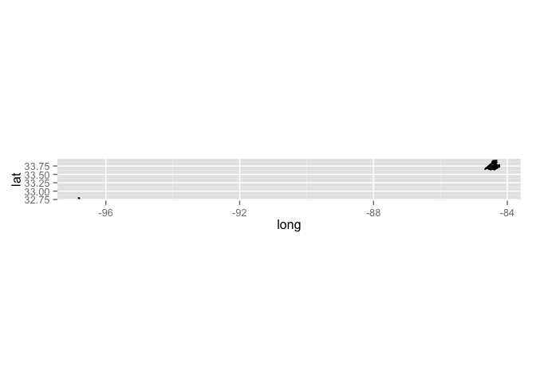
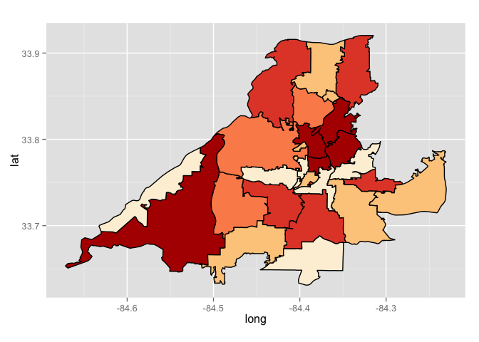
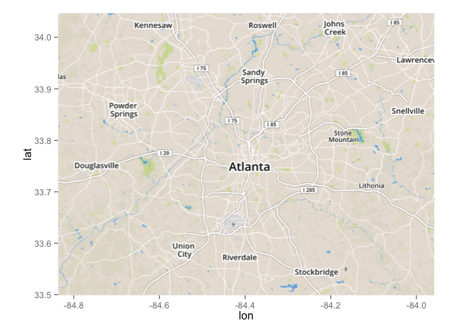
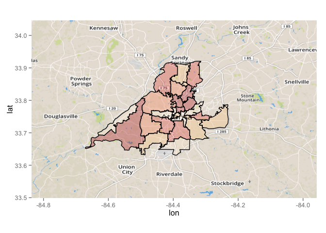
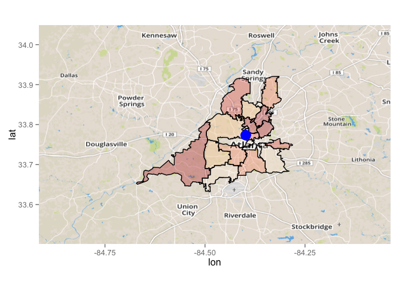
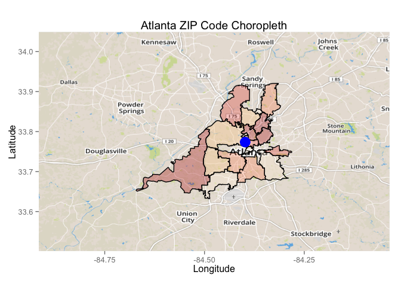

# How to Make Zip Choropleths in R
Brad Dixon  
October 7th, 2014  


## Setup


```r
require(ggplot2)      # for plotting
```

```
## Loading required package: ggplot2
```

```r
require(sp)           # for working with spatial polygons
```

```
## Loading required package: sp
```

```r
require(spdep)        # for computing the distance to the nearest neighbour zip codes
```

```
## Loading required package: spdep
## Loading required package: Matrix
```

```r
require(plyr)         # for mangling data Hadley-fu style
```

```
## Loading required package: plyr
```

```r
require(rgdal)        # for reading shape files
```

```
## Loading required package: rgdal
## rgdal: version: 0.8-16, (SVN revision 498)
## Geospatial Data Abstraction Library extensions to R successfully loaded
## Loaded GDAL runtime: GDAL 1.11.0, released 2014/04/16
## Path to GDAL shared files: /opt/boxen/homebrew/Cellar/gdal/1.11.0/share/gdal
## Loaded PROJ.4 runtime: Rel. 4.8.0, 6 March 2012, [PJ_VERSION: 480]
## Path to PROJ.4 shared files: (autodetected)
```

```r
require(maptools)     # for thinning spatial polygons
```

```
## Loading required package: maptools
## Checking rgeos availability: TRUE
```

```r
require(RColorBrewer) # for colors
```

```
## Loading required package: RColorBrewer
```

```r
require(ggmap)        # for using a map with ggplot
```

```
## Loading required package: ggmap
```

```r
require(plotmapbox)   # for grabbing maps from MapBox
```

```
## Loading required package: plotmapbox
## Loading required package: png
## Loading required package: RgoogleMaps
```

```r
# Special merge function for SpatialPolygonDataFrames
source('lib/spdfMerge.R')
# Function to draw the choropleth
source('lib/choroplethsp.R')
# Helpers that size the plot and grab the map
source('lib/zchoropleth.R')
# Helper functions for fortifying SPDFs with Data
source('lib/fortifyMerge.R')
# Helper to calculate zoom levels
source('lib/calc_zoom.R')

# Read in the Mapbox map key secret
source('secrets.R')

# Set the seed so we get the same random data each run.
set.seed(1)
```

## Zip Code Shapes


```r
# From http://www2.census.gov/geo/tiger/TIGER2014/ZCTA5/tl_2014_us_zcta510.zip
# Download this file and unzip it into a directory named "zips"
ZIPS.spdf = readOGR("./zips", "tl_2014_us_zcta510")
```

```
## OGR data source with driver: ESRI Shapefile 
## Source: "./zips", layer: "tl_2014_us_zcta510"
## with 33144 features and 9 fields
## Feature type: wkbPolygon with 2 dimensions
```

```r
# Column alias
ZIPS.spdf@data$zip = ZIPS.spdf@data$ZCTA5CE10
```

This is a file that has polygon shapes for each Zip Code Tabulation Area. Keep in mind that not all ZIPs have a corresponding ZCTA.

ZIPS.spdf is a SpatialPolygonsDataFrame (SPDF). An SPDF has polygons and data associated with each polygon.


```r
print(summary(ZIPS.spdf@data))
```

```
##    ZCTA5CE10        GEOID10      CLASSFP10   MTFCC10      FUNCSTAT10
##  00601  :    1   00601  :    1   B5:33144   G6350:33144   S:33144   
##  00602  :    1   00602  :    1                                      
##  00603  :    1   00603  :    1                                      
##  00606  :    1   00606  :    1                                      
##  00610  :    1   00610  :    1                                      
##  00612  :    1   00612  :    1                                      
##  (Other):33138   (Other):33138                                      
##     ALAND10            AWATER10              INTPTLAT10   
##  Min.   :5.09e+03   Min.   :0.00e+00   +33.5237117:    2  
##  1st Qu.:2.34e+07   1st Qu.:5.72e+04   +39.2128637:    2  
##  Median :9.28e+07   Median :5.77e+05   +40.9085841:    2  
##  Mean   :2.24e+08   Mean   :5.12e+06   +42.6610738:    2  
##  3rd Qu.:2.29e+08   3rd Qu.:2.76e+06   -14.3195056:    1  
##  Max.   :3.48e+10   Max.   :2.48e+09   +13.2603724:    1  
##                                        (Other)    :33134  
##         INTPTLON10         zip       
##  -064.6829328:    1   00601  :    1  
##  -064.6865698:    1   00602  :    1  
##  -064.7365301:    1   00603  :    1  
##  -064.7459318:    1   00606  :    1  
##  -064.7525564:    1   00610  :    1  
##  -064.7707604:    1   00612  :    1  
##  (Other)     :33138   (Other):33138
```

## Fake Data


```r
# Atlanta zip codes. Watch out for numeric formatted zip codes! You'll want to pad these out and make them characters
zips = c("30032", "30303", "30305", "30306", "30307", "30308", "30309", "30310", "30311", "30312", "30313", "30314", "30315", "30316", "30317", "30318", "30319", "30324", "30326", "30327", "30331", "30332", "30334", "30336", "30342", "30344", "30354", "30363")

# I'm adding in one Dallas zip code to be evil and show why we have to be
# selective when setting map bounds
zips = c(zips, "75201")
DATA = data.frame(
  zip = zips,
  uu = sample(1:100, size=length(zips), replace=TRUE)
)
```

## Simple Choropleth

This is the most basic usage:


```r
# Get just the zip code shapes that we want to illustrate.
SIMPLE_ZIPS.spdf = ZIPS.spdf[ZIPS.spdf@data$ZCTA5CE10 %in% zips,]

# Cut the data
DATA$value = cut_number(DATA$uu, 5)

# Merge
SIMPLE_ZIPS.spdf = spdfMerge(SIMPLE_ZIPS.spdf, DATA, by="zip")

# Now fortify to get a data frame that ggplot can work with.
SIMPLE_ZIPS.df = fortifyMerge(SIMPLE_ZIPS.spdf)
```

```
## Regions defined for each Polygons
```

```r
simple = choroplethsp(SIMPLE_ZIPS.df, "value")
print(simple)
```

 

The obvious problem is that our lone Dallas zip code ruins the plot. This is very typical in our 
data since visitors to a location appear to have significant geographic diversity in home locations.


```r
ATL_ZIPS.df = SIMPLE_ZIPS.df[SIMPLE_ZIPS.df$zip!="75201",]
simple.v2 = choroplethsp(ATL_ZIPS.df, "value")
print(simple.v2)
```

 

Better... but clearly this isn't an automatic operation that we could apply to many choropleths.

## Adding a Map


```r
base = getmapbox_map(c(mean(ATL_ZIPS.df$long), mean(ATL_ZIPS.df$lat)), mapbox=mapbox.key, zoom=10)
map = map_png(base)
print(map)
```

 

This grabs a map from our dedicated non-Google map hosted at MapBox.


```r
simple.v3 = choroplethsp(ATL_ZIPS.df, "value", map)
print(simple.v3)
```

 

The catch here is that setting the zoom level is a manual process. Zoom in too far (by setting zoom to 11) and you'll clip the zip code shapes. This causes them to draw very oddly and is not what you want.

## Using the zchoropleth helper

So far `choroplethsp()` has only used the polygons from the SPDF. `zchoropleth()` assumes more about the SPDF... specifically that it contains ZCTA shaps and data. This data is used to more automatically render the plot. `zchoropleth()` aims to get a decent looking illustration produced but this may involve removing some Zip codes from the plot.


```r
# Lets go back to our original data
DATA = DATA[, c("zip", "uu")]

# zchoropleth will put a dot on the map at a location we specify
long = mean(ATL_ZIPS.df$long)
lat = mean(ATL_ZIPS.df$lat)

zplot=zchoropleth(DATA, ZIPS.spdf, "uu", long, lat)
```

```
## 
##      PLEASE NOTE:  The components "delsgs" and "summary" of the 
##      object returned by deldir() are now DATA FRAMES rather than 
##      matrices (as they were prior to release 0.0-18). 
##      See help("deldir").
##  
##      PLEASE NOTE: The process that deldir() uses for determining
##      duplicated points has changed from that used in version
##      0.0-9 of this package (and previously). See help("deldir").
```

```
## Loading required package: rgeos
## rgeos version: 0.3-5, (SVN revision 447)
##  GEOS runtime version: 3.4.2-CAPI-1.8.2 r3921 
##  Polygon checking: TRUE
```

```r
print(zplot)
```

 

Nice! Note that Dallas has automatically been excluded from the plot. This logic isn't always perfect but it works most of the time in real data sets. Only zip codes that have a closest neighbour that is less than the 3rd quartile of all zip code nearest neighbour distances are retained.

## Finishing off

Since the value returned by `zchoropleth()` is just a ggplot object you can finish of your plot in style.


```r
zplot + 
  labs(title="Atlanta ZIP Code Choropleth", x="Longitude", y="Latitude")
```

 

## Gotchas


```r
zips[ !(zips %in% ZIPS.spdf@data$ZCTA5CE10) ]
```

```
## character(0)
```

In this example we are fortunate that all of the Zip codes in the data set are present in the ZCTA shapefiles. This isn't always the case. If any are missing they will be siliently dropped by `zchoropleth()`.
